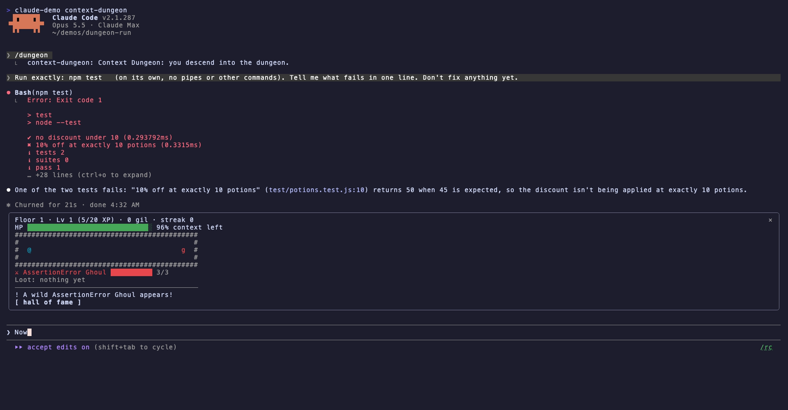
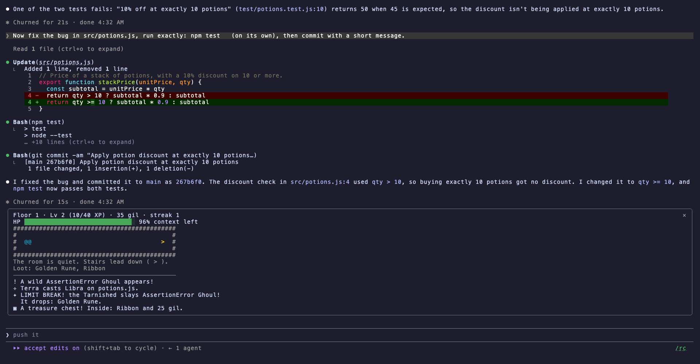

# Context Dungeon


A roguelike that plays itself from your real Claude Code session. Open it with `/dungeon` and watch your work turn into a dungeon crawl.

| In your session | In the dungeon |
|---|---|
| Context window remaining | The party's HP |
| A failing command or test run | A monster spawns, named after the error: *TypeError Wraith*, *ENOENT Imp*, *Red Test Tonberry*. A search that finds nothing (`rg`, `grep`, `diff`) doesn't count |
| Another failure while it's alive | It feeds on the error and grows stronger, up to a cap |
| A passing test run, typecheck or lint | An attack. A clean run is a **LIMIT BREAK** that slays the foe and drops loot |
| A real commit (from Claude Code's git metadata, not the command text) | A treasure chest |
| A pull request opened | The floor boss appears |
| The pull request merged | The boss falls and the stairs to the next floor open |
| Each finished turn | XP; levels grow the party |
| A compaction | Resting at a bonfire: HP restored, kill streak spent |
| Running out of context | A wipe. The run goes into the Hall of Fame and a new party gathers; it can't wipe again until context frees up |

Runs, best floor, best level and the top five runs are kept across sessions in the Hall of Fame. When the pane is closed, a one-line ticker above the prompt shows HP and the current foe. Press `×` to hide it, or run `/dungeon ticker` to toggle it.

The mod only watches. It never blocks or rewrites a tool call, and it ignores subagents and backgrounded commands. HP updates when each turn finishes. The battle log never shows command lines, which can contain secrets.

## Screenshots

| A failing test spawns a monster | A clean run is a LIMIT BREAK, the commit opens a chest |
|---|---|
|  |  |

## Commands

- `/dungeon` opens the dungeon pane.
- `/dungeon fame` opens the Hall of Fame.
- `/dungeon ticker` shows or hides the ticker.

## Install

```
/plugin marketplace add ccdwyer/claude-mods
/plugin install context-dungeon@ccdwyer-mods
/reload-plugins
```

## Develop

```
claude plugin validate .
claude plugin test .
```
